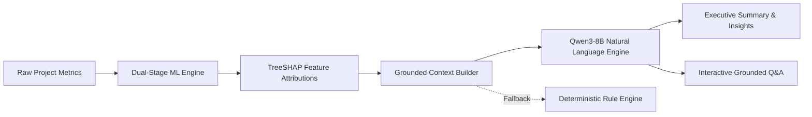

# 🔮 Nirmaan Dristi — AI Prediction Engine

> **Advanced Machine Learning & Explainable AI for Incremental Project Cost & Schedule Forecasting**  
> *Tailored for Central Sector Infrastructure Monitoring (PAIMANA Project-Month Dataset)*

---

## 📑 Table of Contents

- [Overview](#-overview)
- [Key Features](#-key-features)
- [Forecasting Methodology & Mathematical Formulation](#-forecasting-methodology--mathematical-formulation)
- [AI Natural Language & Explainability Layer](#-ai-natural-language--explainability-layer)
- [Architecture & Data Pipeline](#-architecture--data-pipeline)
- [Repository Structure](#-repository-structure)
- [Installation & Setup](#-installation--setup)
- [Quick Start & Execution Guide](#-quick-start--execution-guide)
  - [1. Model Training](#1-model-training)
  - [2. CLI Prediction Engine](#2-cli-prediction-engine)
  - [3. Interactive Streamlit Dashboard](#3-interactive-streamlit-dashboard)
- [Configuration & Environment Variables](#-configuration--environment-variables)
- [Validation & Evaluation Framework](#-validation--evaluation-framework)
- [Tech Stack](#-tech-stack)
- [License & Citation](#-license--citation)

---

## 🌟 Overview

**Nirmaan Dristi** is an end-to-end machine learning and explainable AI system designed to predict future risk, additional cost escalations, and schedule delays for ongoing infrastructure projects.

Unlike standard static models that attempt to predict cumulative project outcomes from inception, Nirmaan Dristi focuses on **incremental forecasting**: predicting the expected **marginal change ($\Delta$)** from the project's current operational status over defined horizons ($h = 3$ and $h = 6$ months).

---

## 🚀 Key Features

- 📈 **Incremental Target Formulation**: Predicts future *additional* cost escalation and schedule extension beyond the current state rather than re-estimating past historical overruns.
- 📐 **Strict Mathematical Consistency**: Guarantees that all forecasted totals (final cost, total delay, tentative completion dates) are derived by adding predicted deltas directly to verified baseline figures.
- ⏱️ **Walk-Forward Temporal Validation**: Evaluates models across chronological expanding windows, completely eliminating temporal data leakage.
- 🎯 **Calibrated Multi-Horizon Modeling**: Provides dual-stage models (Classifiers calibrated with Platt scaling + Regressors) for both 3-month and 6-month forecasting horizons.
- 🧠 **Explainable AI (TreeSHAP)**: Computes local and global feature attributions to highlight specific risk drivers and risk-mitigating factors.
- 🤖 **Qwen3-8B Natural Language Engine**: Translates complex ML and SHAP outputs into executive summaries and interactive project Q&A, backed by a deterministic rule-based fallback when offline.
- 🖥️ **Interactive Web Application**: Full-featured Streamlit UI with project trajectory visualization, scenario analysis, risk heatmaps, timeline breakdown, and an AI chat assistant.

---

## 🧮 Forecasting Methodology & Mathematical Formulation

### 1. Incremental Target Derivation
For an observation of a project at report month $t$ with forecast horizon $h$:

- **Incremental Cost Escalation Target**:
  $$\Delta \text{cost\_overrun\_pct}_{t \to t+h} = \text{cost\_overrun\_pct}_{t+h} - \text{cost\_overrun\_pct}_t$$
  $$\text{Target Binary: } \mathbb{I}(\Delta \text{cost\_overrun\_pct}_{t \to t+h} > \tau_{\text{cost}})$$

- **Incremental Schedule Delay Target**:
  $$\Delta \text{delay\_months}_{t \to t+h} = \text{schedule\_extension\_months}_{t+h} - \text{schedule\_extension\_months}_t$$
  $$\text{Target Binary: } \mathbb{I}(\Delta \text{delay\_months}_{t \to t+h} > \tau_{\text{schedule}})$$

### 2. Mathematical Consistency Rules
All downstream indicators strictly uphold mathematical continuity:

$$\begin{aligned}
\text{Forecasted Final Cost Overrun \%} &= \text{Current Cost Overrun \%} + \widehat{\Delta}\text{Cost Overrun \%} \\
\text{Forecasted Final Overrun Amount (Cr)} &= \text{Current Overrun Amount} + \left( \frac{\widehat{\Delta}\text{Cost Overrun \%}}{100} \times \text{Original Cost} \right) \\
\text{Forecasted Final Total Cost (Cr)} &= \text{Original Cost} + \text{Forecasted Final Overrun Amount} \\
\text{Forecasted Total Extension (Months)} &= \text{Current Extension} + \widehat{\Delta}\text{Delay (Months)} \\
\text{Tentative Completion Date} &= \text{Anticipated Completion Date} + \widehat{\Delta}\text{Delay (Months)}
\end{aligned}$$

### 3. Completed Project Handling
Projects marked as completed have all future forecasts suppressed, presenting a certified historical summary rather than redundant predictive estimates.

---

## 🤖 AI Natural Language & Explainability Layer

Nirmaan Dristi integrates **Qwen3-8B** as an intelligent interpretation layer to provide human-readable narratives and conversational insight.



### Core Guardrails & Capabilities
- **Strict Factual Grounding**: The LLM operates solely as an explainer and translator. Numerical figures are strictly computed by the ML engine.
- **Structured Executive Summaries**: Automatically delineates overall risk posture, top 3 contributing factors, and mitigating factors.
- **Interactive Project Assistant**: Users can ask contextual questions (*"Why is this project delayed?"*, *"What impact does expenditure velocity have?"*) with responses grounded in the underlying SHAP evidence.
- **Zero-Downtime Deterministic Fallback**: In the absence of an API key or during network downtime, a built-in rule engine generates comprehensive explanations directly from SHAP values.

---

## 🏗️ Architecture & Data Pipeline

```
PAIMANA Monthly Reports (CSV)
        │
        ▼
[ Data Loader & Trajectory Enrichment ] ──► (6-mo lags, expenditure velocity, time elapsed)
        │
        ▼
[ Quality Validation Engine ] ────────────► (Schema, range checks, null-rate verification)
        │
        ▼
[ Multi-Horizon Target Builder ] ─────────► (3-month & 6-month delta calculations)
        │
        ▼
[ Walk-Forward Splitter ] ────────────────► (Temporal windowing with zero leakage)
        │
        ├──► [ Cost Models ] ────► XGBoost Classifier (Calibrated) + Ridge/XGBoost Regressor
        │
        └──► [ Schedule Models ] ─► XGBoost Classifier (Calibrated) + Ridge/XGBoost Regressor
```

---

## 📁 Repository Structure

```
paimana_ml/
├── config/
│   └── config.yaml               # Model parameters, thresholds, and LLM configuration
├── data/
│   ├── input/                    # Raw PAIMANA master dataset
│   └── training/                 # Processed training datasets with multi-horizon targets
├── models/
│   ├── preprocessing/            # Serialized ColumnTransformer pipelines
│   └── model_metadata.json       # Versioning, timestamps, and performance metrics
├── results/                      # Evaluation reports, walk-forward metrics, SHAP summaries
├── src/
│   ├── data_loader.py            # CSV ingestion and temporal feature engineering
│   ├── validation.py             # Data sanity checks and schema enforcement
│   ├── feature_selection.py      # Feature definitions and categorical/numerical splitting
│   ├── target_generation.py      # Delta target calculation for 3m & 6m horizons
│   ├── preprocessing.py          # Missing value imputation & OneHotEncoder pipeline
│   ├── walk_forward.py           # Chronological expanding window cross-validation
│   ├── train_cost.py             # Cost model training and probability calibration
│   ├── train_time.py             # Schedule model training and probability calibration
│   ├── evaluate.py               # Metrics engine (Brier score, MedAE, ROC-AUC, MAE)
│   ├── predict.py                # Prediction engine applying mathematical formulas
│   ├── explain.py                # TreeSHAP feature attribution module
│   ├── qwen_service.py           # Qwen3-8B LLM engine and prompt templates
│   └── project_service.py        # High-level API and domain logic service layer
├── app/
│   └── streamlit_app.py          # Full interactive Streamlit dashboard
├── .env.example                  # Environment variable template
├── requirements.txt              # Project dependencies
├── train.py                      # Training pipeline orchestrator
└── predict.py                    # Standalone CLI prediction interface
```

---

## ⚙️ Installation & Setup

### Prerequisites
- Python 3.9+ installed
- Git

### 1. Clone & Set Up Environment

```bash
# Clone the repository
git clone <repository-url>
cd paimana_ml

# Create and activate virtual environment
python -m venv venv

# Windows
.\venv\Scripts\activate

# Linux / macOS
source venv/bin/activate

# Install required dependencies
pip install -r requirements.txt
```

### 2. Configure Environment Variables

Copy `.env.example` to `.env` and configure your settings:

```bash
cp .env.example .env
```

To enable live Qwen3-8B LLM explanations, set your API key in `.env`:
```ini
QWEN_API_KEY=your_dashscope_api_key_here
QWEN_API_BASE=https://dashscope-intl.aliyuncs.com/compatible-mode/v1
QWEN_MODEL_NAME=qwen/qwen3-8b
```
*(If `QWEN_API_KEY` is not set, the system automatically runs the deterministic rule-based explainer).*

---

## 🚦 Quick Start & Execution Guide

### 1. Model Training
Run the complete training, calibration, validation, and SHAP extraction pipeline:

```bash
python train.py
```
*Optional flags:*
- `--csv_path <path>`: Specify a custom path to the master CSV dataset.

### 2. CLI Prediction Engine
Run incremental predictions for any project by ID:

```bash
# Standard prediction output
python predict.py --project_id 400259

# Prediction with AI Natural Language Explanation (Qwen3-8B / Rule-based)
python predict.py --project_id 400259 --explain

# Save prediction output to JSON
python predict.py --project_id 400259 --output result.json
```

### 3. Interactive Streamlit Dashboard
Launch the web interface for visual exploration and scenario analysis:

```bash
streamlit run app/streamlit_app.py
```
Open **[http://localhost:8501](http://localhost:8501)** in your browser to access:
- **Project Selection & Health Cards**: Immediate view of budget, elapsed time, and status.
- **3-Month & 6-Month Incremental Forecasts**: Risk probabilities and predicted deltas.
- **Derived Final Outcomes**: Forecasted final cost, cost overruns, and revised completion dates.
- **AI Executive Summary & Interactive Q&A**: Real-time project question answering.
- **SHAP Importance Charts**: Waterfall and bar charts showing positive and negative drivers.
- **Historical Trajectory Visualization**: Historical expenditure and delay curves over time.

---

## 🔧 Configuration & Environment Variables

All modeling parameters and thresholds can be modified in [`config/config.yaml`](file:///d:/AI%20predictor/paimana_ml/config/config.yaml):

```yaml
cost:
  additional_escalation_threshold_pct: 0.0   # Cost escalation target (> 0 pp)
  major_escalation_threshold_pct: 5.0        # Major escalation flag

schedule:
  additional_delay_threshold_months: 0.0     # Schedule delay target (> 0 months)
  major_delay_threshold_months: 3.0          # Major delay flag

prediction:
  horizons: [3, 6]                           # Forecast horizons in months

models:
  xgboost:
    n_estimators: 150
    max_depth: 5
    learning_rate: 0.05
  calibration:
    enabled: true
    method: "sigmoid"                        # Platt scaling
```

---

## 📊 Validation & Evaluation Framework

The platform employs **Expanding-Window Walk-Forward Validation** to reflect real-world deployment:
1. Training begins on the earliest temporal partition.
2. The model forecasts the subsequent unseen month horizon.
3. The training window expands sequentially through time.

### Evaluation Metrics
| Task | Metrics Evaluated |
| :--- | :--- |
| **Escalation & Delay Risk (Classification)** | ROC-AUC, Brier Score, Precision, Recall, F1-Score |
| **Delta Magnitude (Regression)** | Median Absolute Error (MedAE), Mean Absolute Error (MAE), RMSE |
| **Probability Quality** | Expected Calibration Error (ECE) & Reliability Diagrams |

---

## 💻 Tech Stack

- **Core**: Python 3.9+, NumPy, Pandas
- **Machine Learning**: Scikit-Learn, XGBoost, Joblib
- **Explainability**: TreeSHAP (SHAP)
- **Natural Language & GenAI**: Qwen3-8B (OpenAI-compatible API client)
- **Visualization & UI**: Streamlit, Plotly, Matplotlib
- **Configuration**: PyYAML, Python-Dotenv

---

## 📄 License & Citation

Developed for monitoring and predictive analytics of Central Sector Infrastructure Projects under the **Nirmaan Dristi** initiative.
